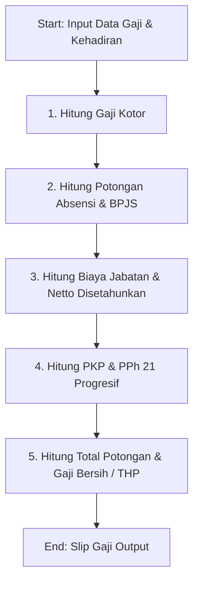

# DOKUMENTASI PENJELASAN LOGIKA PERHITUNGAN GAJI DAN POTONGAN PAJAK PPh 21
**Sistem Informasi Penggajian Karyawan (GajiKita)**
*Ditujukan Kepada: Dosen Asesor / Penguji Sertifikasi / Tim Penilai Akademik*

---

## 📑 Executive Summary / Ringkasan Eksekutif

Dokumen ini disusun sebagai wujud pertanggungjawaban teknis dan akademis dalam implementasi modul penggajian pada aplikasi **GajiKita**. Penjelasan di bawah ini mencakup seluruh landasan regulasi, formula matematika, alur logika program, hingga simulasi perhitungan numerik nyata yang diterapkan dalam sistem.

Seluruh logika penggajian dipusatkan secara modular pada utility file [`src/utils/salaryCalculator.ts`](file:///c:/Users/PC/Documents/Projekl/Web-Gaji-Karyawan/src/utils/salaryCalculator.ts) dan telah terverifikasi melalui pengujian otomatis (*Unit Testing*) di [`src/utils/salaryCalculator.test.ts`](file:///c:/Users/PC/Documents/Projekl/Web-Gaji-Karyawan/src/utils/salaryCalculator.test.ts).

---

## 1. ⚖️ Landasan Regulasi & Acuan Hukum

Sistem perhitungan dalam aplikasi **GajiKita** disesuaikan dengan peraturan perundang-undangan perpajakan dan ketenagakerjaan terkini di Indonesia:

1. **Pajak Penghasilan (PPh Pasal 21)**:
   - **UU No. 7 Tahun 2021** tentang Harmonisasi Peraturan Perpajakan (**UU HPP**) Pasal 17 (Tarif Progresif PPh 21 Orang Pribadi).
   - **PTKP (Penghasilan Tidak Kena Pajak)**: Menggunakan acuan standar **TK/0** (Tidak Kawin / Tanpa Tanggungan) sebesar **Rp 54.000.000,- / tahun** (Rp 4.500.000,- / bulan).
   - **Biaya Jabatan**: Sebesar **5% dari Gaji Kotor**, dengan batas maksimal potongan **Rp 500.000,- / bulan** (Rp 6.000.000,- / tahun).

2. **Jaminan Sosial Ketenagakerjaan & Kesehatan**:
   - **BPJS Kesehatan**: Potongan pekerja sebesar **1% dari Gaji Pokok**.
   - **BPJS Ketenagakerjaan (JHT - Jaminan Hari Tua)**: Potongan pekerja sebesar **2% dari Gaji Pokok**.

3. **Standar Kehadiran & Lembur (Operational Rules)**:
   - Jumlah hari kerja efektif dalam 1 bulan diset sebesar **22 hari kerja**.
   - **Tunjangan Kehadiran**: Rp 50.000,- per hari hadir.
   - **Tarif Lembur**: Rp 30.000,- per jam lembur.

---

## 2. 🧮 Formula & Rumus Perhitungan Sistem

Perhitungan gaji dilakukan melalui 5 tahapan utama secara berurutan (*sequential process*):



### Tahap 1: Penghasilan Kotor (Gaji Kotor / Gross Salary)
$$\text{Tunjangan Kehadiran} = \text{Hari Hadir} \times \text{Rp } 50.000$$
$$\text{Gaji Lembur} = \text{Jam Lembur} \times \text{Rp } 30.000$$
$$\text{Gaji Kotor} = \text{Gaji Pokok} + \text{Tunjangan Jabatan} + \text{Tunjangan Kehadiran} + \text{Gaji Lembur}$$

---

### Tahap 2: Potongan Absensi & Jaminan Sosial (BPJS)
$$\text{Potongan Alpha} = \text{Round}\left(\frac{\text{Gaji Pokok}}{22} \times \text{Hari Alpha}\right)$$
$$\text{BPJS Kesehatan (1\%)} = \text{Round}(\text{Gaji Pokok} \times 0{,}01)$$
$$\text{BPJS Ketenagakerjaan (2\%)} = \text{Round}(\text{Gaji Pokok} \times 0{,}02)$$
$$\text{Total Potongan Non-Pajak} = \text{Potongan Alpha} + \text{BPJS Kesehatan} + \text{BPJS Ketenagakerjaan}$$

---

### Tahap 3: Penghasilan Netto & PKP (Penghasilan Kena Pajak)
$$\text{Biaya Jabatan Sebulan} = \min(\text{Gaji Kotor} \times 0{,}05, 500.000)$$
$$\text{Netto Sebulan} = \text{Gaji Kotor} - \text{BPJS Ketenagakerjaan} - \text{Biaya Jabatan Sebulan}$$
$$\text{Netto Disetahunkan} = \max(0, \text{Netto Sebulan} \times 12)$$
$$\text{PKP Setahun} = \max(0, \text{Netto Disetahunkan} - \text{PTKP (Rp } 54.000.000))$$

---

### Tahap 4: Pajak PPh 21 Progresif (UU HPP Pasal 17)

Pajak PPh 21 dihitung berdasarkan tarif bertingkat (*progresif*) sesuai sisa nilai PKP:

| Lapisan (Bracket) PKP Setahun | Tarif Pajak | Formula Perhitungan |
| :--- | :---: | :--- |
| **Lapisan I**: Rp 0 s.d. Rp 60.000.000 | **5%** | $\text{PKP} \times 5\%$ |
| **Lapisan II**: > Rp 60.000.000 s.d. Rp 250.000.000 | **15%** | $(\text{PKP} - 60\text{Jt}) \times 15\% + 3.000.000$ |
| **Lapisan III**: > Rp 250.000.000 s.d. Rp 500.000.000 | **25%** | $(\text{PKP} - 250\text{Jt}) \times 25\% + 31.500.000$ |
| **Lapisan IV**: > Rp 500.000.000 s.d. Rp 5.000.000.000 | **30%** | $(\text{PKP} - 500\text{Jt}) \times 30\% + 94.000.000$ |
| **Lapisan V**: > Rp 5.000.000.000 | **35%** | $(\text{PKP} - 5\text{M}) \times 35\% + 1.444.000.000$ |

$$\text{PPh 21 Sebulan} = \text{Round}\left(\frac{\text{PPh 21 Setahun}}{12}\right)$$

---

### Tahap 5: Gaji Bersih / Take Home Pay (THP)
$$\text{Total Potongan} = \text{Potongan Alpha} + \text{BPJS Kesehatan} + \text{BPJS Ketenagakerjaan} + \text{PPh 21 Sebulan}$$
$$\text{Gaji Bersih (THP)} = \text{Gaji Kotor} - \text{Total Potongan}$$

---

## 3. 📊 Simulasi Perhitungan Real (Studi Kasus / Contoh Lembar Kerja)

Berikut disajikan 2 skenario pengujian numerik nyata yang dihitung oleh sistem:

### 🟢 Skenario 1: Karyawan Senior (Kena PPh 21 Progresif)

**Profil Data Input**:
- Gaji Pokok: **Rp 8.000.000,-**
- Tunjangan Jabatan: **Rp 1.500.000,-**
- Kehadiran: 22 hari (0 Alpha, 0 Sakit/Cuti)
- Lembur: 0 jam

**Langkah Perhitungan**:

1. **Penghasilan Kotor**:
   - Tunjangan Hadir = $22 \times \text{Rp } 50.000 = \text{Rp } 1.100.000$
   - Gaji Kotor = $\text{Rp } 8.000.000 + 1.500.000 + 1.100.000 = \mathbf{Rp\ 10.600.000,-}$

2. **Potongan BPJS & Absensi**:
   - Potongan Alpha = Rp 0
   - BPJS Kesehatan = $1\% \times \text{Rp } 8.000.000 = \mathbf{Rp\ 80.000,-}$
   - BPJS Ketenagakerjaan (JHT) = $2\% \times \text{Rp } 8.000.000 = \mathbf{Rp\ 160.000,-}$

3. **Perhitungan Netto & PKP**:
   - Biaya Jabatan = $5\% \times \text{Rp } 10.600.000 = \text{Rp } 530.000$ (Maksimal dibatasi **Rp 500.000,-**)
   - Netto Sebulan = $\text{Rp } 10.600.000 - \text{Rp } 160.000 - \text{Rp } 500.000 = \mathbf{Rp\ 9.940.000,-}$
   - Netto Disetahunkan = $\text{Rp } 9.940.000 \times 12 = \mathbf{Rp\ 119.280.000,-}$
   - PTKP (TK/0) = Rp 54.000.000,-
   - PKP Setahun = $\text{Rp } 119.280.000 - \text{Rp } 54.000.000 = \mathbf{Rp\ 65.280.000,-}$

4. **Perhitungan Pajak PPh 21 Progresif**:
   - Lapis 1 (5% s.d. 60 Jt) = $5\% \times \text{Rp } 60.000.000 = \text{Rp } 3.000.000$
   - Lapis 2 (15% dari sisa) = $15\% \times (\text{Rp } 65.280.000 - 60.000.000) = 15\% \times \text{Rp } 5.280.000 = \text{Rp } 792.000$
   - Total PPh 21 Setahun = $\text{Rp } 3.000.000 + \text{Rp } 792.000 = \mathbf{Rp\ 3.792.000,-}$
   - **PPh 21 Sebulan** = $\text{Rp } 3.792.000 / 12 = \mathbf{Rp\ 316.000,-}$

5. **Hasil Akhir (Take Home Pay)**:
   - Total Potongan = $\text{Rp } 80.000 + 160.000 + 316.000 = \mathbf{Rp\ 556.000,-}$
   - **Gaji Bersih (THP)** = $\text{Rp } 10.600.000 - 556.000 = \mathbf{Rp\ 10.044.000,-}$

---

### 🟡 Skenario 2: Karyawan Staff (Bebas Pajak / Di Bawah PTKP)

**Profil Data Input**:
- Gaji Pokok: **Rp 3.500.000,-**
- Tunjangan Jabatan: **Rp 500.000,-**
- Kehadiran: 20 hari hadir, 2 hari Alpha (0 Sakit/Cuti)
- Lembur: 5 jam

**Langkah Perhitungan**:

1. **Penghasilan Kotor**:
   - Tunjangan Hadir = $20 \times \text{Rp } 50.000 = \text{Rp } 1.000.000$
   - Uang Lembur = $5 \times \text{Rp } 30.000 = \text{Rp } 150.000$
   - Gaji Kotor = $\text{Rp } 3.500.000 + 500.000 + 1.000.000 + 150.000 = \mathbf{Rp\ 5.150.000,-}$

2. **Potongan Absensi & BPJS**:
   - Potongan Alpha = $\text{Round}((\text{Rp } 3.500.000 / 22) \times 2) = \mathbf{Rp\ 318.182,-}$
   - BPJS Kesehatan = $1\% \times \text{Rp } 3.500.000 = \mathbf{Rp\ 35.000,-}$
   - BPJS Ketenagakerjaan = $2\% \times \text{Rp } 3.500.000 = \mathbf{Rp\ 70.000,-}$

3. **Perhitungan Netto & PKP**:
   - Biaya Jabatan = $5\% \times \text{Rp } 5.150.000 = \text{Rp } 257.500$
   - Netto Sebulan = $\text{Rp } 5.150.000 - 70.000 - 257.500 = \text{Rp } 4.822.500$
   - Netto Disetahunkan = $\text{Rp } 4.822.500 \times 12 = \text{Rp } 57.870.000$
   - PTKP (TK/0) = Rp 54.000.000,-
   - PKP Setahun = $\text{Rp } 57.870.000 - \text{Rp } 54.000.000 = \mathbf{Rp\ 3.870.000,-}$

4. **Perhitungan Pajak PPh 21 Progresif**:
   - PKP Rp 3.870.000 berada di Lapisan 1 (5%)
   - PPh 21 Setahun = $5\% \times \text{Rp } 3.870.000 = \text{Rp } 193.500$
   - **PPh 21 Sebulan** = $\text{Round}(\text{Rp } 193.500 / 12) = \mathbf{Rp\ 16.125,-}$

5. **Hasil Akhir (Take Home Pay)**:
   - Total Potongan = $\text{Rp } 318.182 + 35.000 + 70.000 + 16.125 = \mathbf{Rp\ 439.307,-}$
   - **Gaji Bersih (THP)** = $\text{Rp } 5.150.000 - 439.307 = \mathbf{Rp\ 4.710.693,-}$

---

## 4. 💻 Pemetaan Struktur Kode Program

Logika matematis di atas diimplementasikan pada kode TypeScript dengan fungsi-fungsi utama sebagai berikut:

### 1. Fungsi `hitungPajakProgresif()`
Berada pada file [src/utils/salaryCalculator.ts](file:///c:/Users/PC/Documents/Projekl/Web-Gaji-Karyawan/src/utils/salaryCalculator.ts#L44-L93):

```typescript
export function hitungPajakProgresif(pkp: number): number {
  if (pkp <= 0) return 0;
  let pajak = 0;
  let sisa = pkp;

  // Bracket 1: 5% sampai Rp 60.000.000
  const limit1 = 60000000;
  if (sisa > limit1) {
    pajak += limit1 * 0.05;
    sisa -= limit1;
  } else {
    pajak += sisa * 0.05;
    return pajak;
  }

  // Bracket 2: 15% s.d Rp 250.000.000
  const limit2 = 190000000;
  if (sisa > limit2) {
    pajak += limit2 * 0.15;
    sisa -= limit2;
  } else {
    pajak += sisa * 0.15;
    return pajak;
  }

  // ... Bracket 3, 4, 5 lanjutan ...
  return pajak;
}
```

### 2. Pengujian Unit (Unit Test Suite)
Seluruh skenario perhitungan diuji secara otomatis menggunakan kerangka pengujian **Vitest** pada [src/utils/salaryCalculator.test.ts](file:///c:/Users/PC/Documents/Projekl/Web-Gaji-Karyawan/src/utils/salaryCalculator.test.ts):

- ✅ `it('harus menghitung pajak 5% untuk PKP hingga Rp 60.000.000')`
- ✅ `it('harus menerapkan tarif progresif untuk PKP di atas Rp 60.000.000')`
- ✅ `it('harus menghitung nilai gaji dengan benar untuk karyawan standar')`
- ✅ `it('harus menghitung potongan alpha/absen dengan benar')`

---

## 5. 🎯 Kesimpulan

1. **Akurasi Regulasi**: Perhitungan PPh 21 pada aplikasi **GajiKita** telah mengikuti ketentuan tarif progresif UU HPP No. 7/2021 dengan memperhitungkan PTKP, Biaya Jabatan, serta iuran BPJS Kesehatan & Ketenagakerjaan.
2. **Kerapian Arsitektur**: Seluruh perhitungan terenkapsulasi murni (*pure functions*) sehingga terhindar dari *side effect*, mudah diuji (*testable*), serta konsisten saat dipanggil baik di Server Side (API) maupun Client Side (UI).
3. **Kesiapan Penilaian**: Kode dan formula dapat diverifikasi secara independen melalui pengujian otomatis (*unit tests*) yang dapat dijalankan melalui perintah `npm test`.


