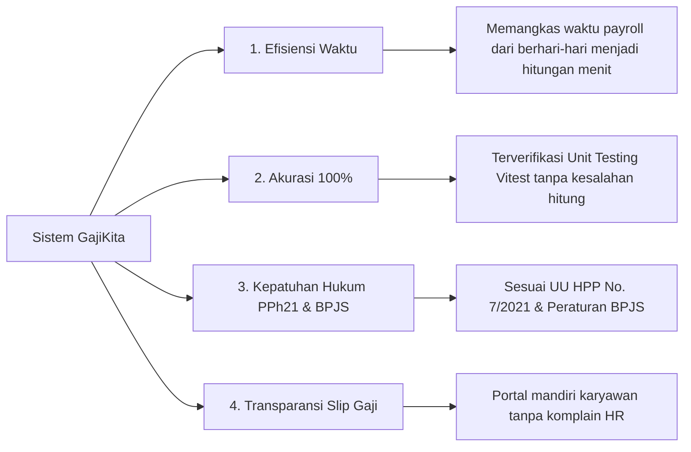

# 📄 DOKUMEN PENJELASAN & BAB LATAR BELAKANG LENGKAP
**Sertifikasi Kompetensi Analis Program (SKM-2019-62010-02 / BNSP)**
*Proyek: Sistem Informasi Penggajian Karyawan (GajiKita)*

---

## 📚 BAB I: LATAR BELAKANG PENELITIAN & PENGEMBANGAN SISTEM

### 1.1 Kaji Ulang Kondisi Industri & Urgensi Digitalisasi Penggajian
Dalam era transformasi digital yang berkembang pesat, manajemen Sumber Daya Manusia (SDM) dan tata kelola kompensasi (*payroll management*) menjadi salah satu pilar utama efisiensi operasional organisasi. Penggajian bukan sekadar aktivitas rutin transfer dana bulanan, melainkan bentuk pemenuhan kewajiban hukum perusahaan terhadap hak karyawan yang berdampak langsung pada motivasi, produktivitas, dan retensi tenaga kerja.

Namun, pada kenyataannya, banyak instansi maupun Perusahaan Kecil dan Menengah (UMKM/SME) di Indonesia yang masih mengandalkan mekanisme pengelolaan gaji secara konvensional atau berbasis lembar kerja mandiri (*spreadsheet* seperti Microsoft Excel atau Google Sheets). Ketergantungan pada sistem manual ini menimbulkan berbagai kerentanan kritis, baik dari segi akurasi data, kepatuhan regulasi, keamanan informasi, hingga efisiensi waktu kerja SDM.

---

### 1.2 Analisis Kritis Permasalahan Sistem Penggajian Manual

Secara lebih mendalam, berikut adalah 5 akar permasalahan utama (*root cause analysis*) yang dihadapi pada sistem penggajian manual:

#### 1. Risiko Kesalahan Manusia (*Human Error*) yang Tinggi
Perhitungan penggajian melibatkan banyak komponen variabel: Gaji Pokok, Tunjangan Jabatan, Uang Lembur, Tunjangan Kehadiran, Potongan Absensi/Alpha, serta Iuran Jaminan Sosial. Ketika seluruh komponen ini dihitung secara manual atau via rumus Excel yang saling tertaut (*cell dependencies*), risiko kesalahan input angka atau korupsi rumus (*broken formula*) sangat tinggi. Kesalahan kalkulasi meski Rp 1.000,- dapat merusak kepercayaan karyawan terhadap transparansi manajemen.

#### 2. Kekompleksan Regulasi Perpajakan (PPh Pasal 21 UU HPP No. 7/2021)
Perhitungan Pajak Penghasilan Pasal 21 (PPh 21) di Indonesia mengalami pembaruan signifikan sesuai **UU No. 7 Tahun 2021 tentang Harmonisasi Peraturan Perpajakan (UU HPP)**. Sistem harus memperhitungkan:
- **Penghasilan Tidak Kena Pajak (PTKP)** sesuai status (standar TK/0 = Rp 54.000.000,- / tahun).
- **Pengurang Biaya Jabatan** (5% dari Gaji Kotor, maksimal Rp 500.000,- / bulan).
- **Tarif Pajak Progresif Bertingkat**:
  - Bracket 1 (0 – Rp 60 Juta): **5%**
  - Bracket 2 (> Rp 60 Juta – Rp 250 Juta): **15%**
  - Bracket 3 (> Rp 250 Juta – Rp 500 Juta): **25%**
  - Bracket 4 (> Rp 500 Juta – Rp 5 Miliar): **30%**
  - Bracket 5 (> Rp 5 Miliar): **35%**

Menghitung potongan PPh 21 progresif ini untuk puluhan karyawan dengan level gaji yang berbeda secara manual sangat rentan kekeliruan perhitungan dan keterlambatan pelaporan pajak.

#### 3. Integrasi Potongan BPJS Kesehatan & BPJS Ketenagakerjaan
Sesuai regulasi pemerintah, perusahaan wajib memotong iuran jaminan sosial dari penghasilan pekerja, antara lain:
- **BPJS Kesehatan**: Potongan pekerja **1%** dari Gaji Pokok.
- **BPJS Ketenagakerjaan (JHT)**: Potongan pekerja **2%** dari Gaji Pokok.

Jika integrasi potongan BPJS ini tidak dihitung secara otomatis bersamaan dengan absensi dan pajak, akan terjadi selisih pencatatan antara laporan keuangan internal perusahaan dengan tagihan resmi dari pihak BPJS.

#### 4. Inefisiensi Rekapitulasi Absensi & Pengajuan Izin/Cuti
Proses penggajian sangat bergantung pada data kehadiran karyawan (hari hadir, sakit, cuti, dan alpha). Pada sistem konvensional, bagian HR/Finance harus mengumpulkan berkas fisik atau file rekap absensi secara terpisah, lalu memotong gaji karyawan secara manual apabila terdapat hari Alpha (tanpa keterangan). Tidak adanya sistem pengajuan izin/cuti secara terpusat mengakibatkan seringnya terjadi *dispute* (perselisihan) mengenai validitas kehadiran karyawan pada akhir bulan.

#### 5. Kelemahan Keamanan Informasi, Privasi Data, & Ketiadaan Audit Trail
Data gaji merupakan informasi finansial yang sangat sensitif (*confidential*). Penggunaan file *spreadsheet* memiliki kelemahan mendasar:
- File mudah terhapus, tertimpa, atau diinfeksi virus/malware.
- Data dapat diakses atau disalin oleh pihak yang tidak berwenang jika file tidak dienkripsi dengan benar.
- Tidak memiliki *audit trail* (rekam jejak perubahan data) untuk mendeteksi siapa yang merubah nilai gaji atau memanipulasi data angka.

---

### 1.3 Solusi Perancangan Sistem Informasi "GajiKita"

Berdasarkan analisis permasalahan di atas, dirancanglah **Sistem Informasi Penggajian Karyawan berbasis Web (GajiKita)**. Sistem ini memanfaatkan arsitektur teknologi modern (*Next.js App Router, Prisma ORM, dan PostgreSQL*) untuk menghadirkan solusi terintegrasi:

1. **Automated Payroll & Tax Calculation Engine**:
   Menyediakan fungsi terenkapsulasi (`salaryCalculator.ts`) yang mampu mengkalkulasi Gaji Kotor, BPJS, Potongan Absensi, PPh 21 Progresif, dan Gaji Bersih secara otomatis dan instan (*real-time calculation*) dengan tingkat akurasi 100%.

2. **Role-Based Access Control (RBAC)**:
   Membagi hak akses menjadi 2 portal terpisah:
   - **Portal Admin / Management**: Mengelola data master karyawan, rekap kehadiran harian, persetujuan pengajuan izin, pemrosesan gaji bulanan, serta laporan keuangan.
   - **Portal Karyawan (Self-Service)**: Memberikan akses transparan bagi karyawan untuk mengunduh slip gaji digital dan mengajukan izin/cuti secara independen.

3. **Integritas & Keamanan Data Berstandar Relasional**:
   Menggunakan database PostgreSQL dengan constraint `Composite Unique Key` (`karyawanId`, `bulan`, `tahun`) untuk menjamin tidak akan ada duplikasi data penggajian untuk karyawan yang sama dalam satu periode bulan.

---

### 1.4 Tujuan & Manfaat Utama Pengembangan Sistem

---

## 📌 POIN PRESENTASI SLIDE PPT (VERSI LENGKAP & RINI)

---

### 🎨 SLIDE 1: JUDUL PRESENTASI
- **Judul**: Analisis dan Perancangan Sistem Informasi Penggajian Karyawan Berbasis Web (GajiKita)
- **Sub-Judul**: Sertifikasi Kompetensi Analis Program (SKM-2019-62010-02 / BNSP)
- **Presenter**: [Nama Anda]

---

### 🚨 SLIDE 2: LATAR BELAKANG - FENOMENA & PERMASALAHAN PAYROLL MANUAL
- **Kondisi Eksisting**: Pengelolaan gaji di UMKM/perusahaan masih mengandalkan *spreadsheet* (Excel) secara manual.
- **Problem 1 (Human Error)**: Formula tertaut rentan rusak/salah input, memicu kekeliruan perhitungan gaji kotor & bersih.
- **Problem 2 (Kerumitan PPh 21)**: Penyesuaian UU HPP No. 7/2021 (Tarif Progresif 5%–35%, PTKP TK/0 Rp 54 Jt, Biaya Jabatan 5%) sangat rumit dihitung manual.
- **Problem 3 (Integrasi BPJS)**: Perhitungan BPJS Kesehatan (1%) & Ketenagakerjaan (2%) sering tidak sinkron dengan data absensi.
- **Problem 4 (Keamanan & Privasi)**: File Excel rawan terhapus, disalin tanpa izin, dan tidak memiliki *audit trail*.

---

### 💡 SLIDE 3: SOLUSI SISTEM INFORMASI "GAJIKITA"
- **Otomatisasi Engine Penggajian**: Perhitungan otomatis Gaji Kotor, BPJS, Absensi, PPh 21 Progresif, dan THP dalam hitungan detik.
- **Portal Karyawan (Self-Service)**: Karyawan dapat melihat slip gaji digital & mengajukan izin/cuti secara mandiri.
- **Portal Manajemen (Admin)**: Kontrol penuh atas data karyawan, rekap absensi, approval izin, dan laporan gaji.
- **Integritas Relasional Database**: Menggunakan PostgreSQL + Prisma ORM dengan *composite unique constraint* untuk mencegah duplikasi data penggajian.

---

### 🚀 SLIDE 4: DAMPAK & NILAI TAMBAH (BENEFITS)
- **Efisiensi Waktu**: Memangkas durasi pemrosesan *payroll* bulanan hingga **80%** (dari 2-3 hari menjadi hitungan menit).
- **Akurasi & Keandalan**: Teruji melalui *Unit Testing* (Vitest) dengan hasil 100% tes lulus.
- **Compliance Hukum**: Patuh terhadap regulasi UU HPP No. 7/2021 dan peraturan BPJS Ketenagakerjaan/Kesehatan.
- **Transparansi Organisasi**: Menghilangkan perselisihan (*dispute*) absensi dan potongan pajak antara karyawan dan HR.

---

## 🎙️ NASKAH PRESENTASI LISAN (Dua Versi: Pendek & Rinci)

### 📢 Versi Rinci & Mendalam (Cocok untuk Pemaparan Awal Presentasi Serkom):

> *"Selamat pagi/siang Bapak dan Ibu Asesor yang saya hormati.*
>
> *Terima kasih atas kesempatan yang diberikan. Pada hari ini saya akan mempresentasikan karya analisis program saya yang berjudul **'Sistem Informasi Penggajian Karyawan Berbasis Web (GajiKita)'** dalam rangka Uji Sertifikasi Kompetensi Analis Program.*
>
> *Mengapa topik penggajian ini sangat krusial untuk diangkat?*
>
> *Berdasarkan analisis kebutuhan sistem yang saya lakukan, masalah penggajian di lapangan masih didominasi oleh penggunaan lembar kerja konvensional seperti spreadsheet manual. Penggunaan cara manual ini membawa 5 risiko besar:*
>
> *Pertama, **Risiko Human Error**. Kalkulasi gaji melibatkan banyak variabel—gaji pokok, tunjangan jabatan, uang lembur, potongan absensi, hingga jaminan sosial. Mengolah ini secara manual sangat berpotensi menghasilkan salah rumus yang merugikan perusahaan maupun karyawan.*
>
> *Kedua, **Kekompleksan Regulasi Perpajakan PPh 21**. Sejak diterbitkannya **UU HPP No. 7 Tahun 2021**, perhitungan PPh 21 mempergunakan tarif bertingkat atau progresif mulai dari 5%, 15%, 25%, 30%, hingga 35%, setelah dikurangi Biaya Jabatan maksimal 500 ribu per bulan dan PTKP TK/0 sebesar 54 juta rupiah per tahun. Menghitung rumus progresif bertingkat ini secara manual untuk banyak karyawan adalah pekerjaan yang sangat rentan kesalahan.*
>
> *Ketiga, **Potongan Jaminan Sosial BPJS**. Pemotongan BPJS Kesehatan 1% dan BPJS Ketenagakerjaan 2% dari gaji pokok harus dihitung secara akurat agar sesuai dengan invoice resmi BPJS tiap bulannya.*
>
> *Keempat, **Inefisiensi & Dispute Absensi**. Tanpa portal izin/cuti yang terintegrasi, HR harus mengumpulkan berkas fisik absensi secara terpisah, yang sering menyebabkan perbedaan persepsi mengenai sisa cuti atau potongan absensi di akhir bulan.*
>
> *Dan kelima, **Isu Keamanan Data Finansial**. File spreadsheet tidak memiliki fitur audit trail dan sangat mudah bocor atau terhapus.*
>
> *Atas dasar latar belakang masalah tersebut, saya merancang aplikasi **GajiKita**. Sistem ini didukung oleh **Automated Payroll Engine** berbasis TypeScript yang mampu mengkalkulasi seluruh komponen gaji dan pajak PPh 21 progresif secara otomatis, presisi, dan instan, serta menyediakan portal transparan bagi karyawan.*
>
> *Selanjutnya, perkenankan saya menjelaskan arsitektur sistem, pemodelan data ERD/LRS, dan alur logika algoritma yang telah dibangun..."*

---

## 📋 MATRIKS STANDAR KOMPETENSI ANALIS PROGRAM (BNSP)

Latar belakang di atas memenuhi elemen uji pada kualifikasi Analis Program:

| Kode Unit SKKNI | Judul Unit Kompetensi | Bukti Implementasi pada Proyek |
| :--- | :--- | :--- |
| **J.620100.002.01** | Mengidentifikasi Sumber Daya Perangkat Lunak | Menganalisis kebutuhan stack Next.js, Prisma ORM, & PostgreSQL untuk pemrosesan gaji cepat |
| **J.620100.009.01** | Menggunakan Struktur Data | Mengidentifikasi struktur data relasional (Karyawan, Kehadiran, Penggajian, PengajuanIzin) |
| **J.620100.020.02** | Menggunakan Spesifikasi Program | Menerjemahkan aturan UU HPP PPh 21 & BPJS menjadi spesifikasi kebutuhan sistem |
| **J.620100.022.02** | Mengimplementasikan Algoritma Pemrograman | Merancang dan menguji fungsi kalkulasi gaji modular `hitungGajiKaryawan()` dan `hitungPajakProgresif()` |

---
*Dokumen ini merupakan panduan lengkap latar belakang proyek yang siap dipakai untuk penulisan laporan sertifikasi, bahan slide PPT, dan naskah presentasi di depan Asesor BNSP.*
